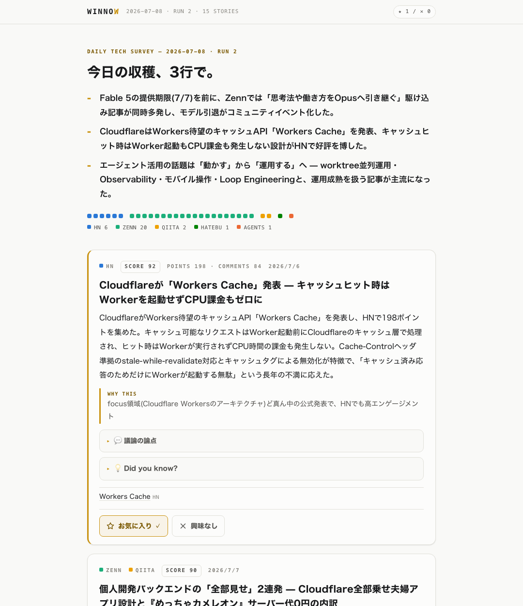

# Winnow

**技術記事サーベイダイジェスト生成 — Claude Code skill**

Hacker News / Zenn / Qiita / はてなブックマーク / GitHub Trending / Reddit / lobste.rs を1コマンドで横断サーベイし、興味プロファイルに基づいて選別・要約した「朝刊」を生成します。

名前は英単語 *winnow*（風選する）に由来します。籾殻（ノイズ）を風で飛ばし、実（価値ある記事）だけを残す、という意味です。



## 特徴

- **ストーリー単位のクラスタリング** — 複数ソースで重複する話題を1つに束ね、「何ソースで話題になっているか」を注目度シグナルとして使います
- **議論の要約** — 記事本文だけでなく、Hacker Newsのコメント欄で賛否が分かれている論点まで要約します
- **フィードバック学習** — レポート上の「お気に入り / 興味なし」ボタンで判定を記録すると、次回サーベイの選別に反映されます。判定は保存され、次に開いたときも表示・変更できます。興味の外の良記事を混ぜるセレンディピティ枠つき
- **二層出力** — grep可能なMarkdownと、自己完結のHTMLレポート（JavaScript無効でも全文可読、ライト / ダーク対応）
- **毎朝の自動実行** — launchdで毎朝7時にheadless実行し、結果をmacOS通知
- **どこからでも閲覧** — Cloudflare Workers（無料枠）に静的サイトとして自動デプロイ。閲覧は公開、フィードバック操作はログインしたオーナーのみに表示されます

## 仕組み

```
fetch層 (シェルスクリプト x9)        HTTP取得はすべて決定論的なスクリプトが担当
  └─ ingest (node:sqlite)          URL正規化・重複排除・既読管理・学習プロファイル導出
      └─ Claude Code               クラスタリング → スコアリング → 選別 → 要約 (stories.json)
          └─ validate → finalize → render → publish
              ├─ output/…/report.{md,html}                    ローカル
              └─ Cloudflare Workers Static Assets + Hono API + D1   クラウド
```

設計の詳細は [REQUIREMENTS.md](REQUIREMENTS.md) を、先行事例の調査記録は [docs/research/](docs/research/) を参照してください。

## 動作要件

| 要件 | 備考 |
|------|------|
| macOS | launchd・通知を使用（パイプライン自体は他OSでも動作） |
| [Claude Code](https://claude.com/claude-code) | 選別・要約のLLMステップを担当 |
| Node.js >= 23.4 | `node:sqlite` を使用。npm依存はローカルではゼロ |
| jq / curl | fetch層で使用 |
| Cloudflareアカウント + wrangler | クラウド配信を使う場合のみ（任意） |

## クイックスタート

```bash
git clone https://github.com/asriel-dev-apps/winnow.git && cd winnow

# 1. 興味プロファイルと収集ソースを自分用に編集する
$EDITOR config/interests.yaml config/sources.json

# 2. Claude Code skillとして登録する
ln -s "$PWD" ~/.claude/skills/winnow

# 3. Claude Codeのセッションで実行する
#    /winnow
```

初回実行でDB作成、収集、レポート生成、ブラウザ表示まで動きます。動作確認は `bash scripts/smoke.sh` で行えます。

## 毎朝の自動実行

```bash
bash scripts/install-launchd.sh        # 解除は --uninstall
```

次の2つが登録されます。

- `com.winnow.daily` — 毎朝7時のサーベイ実行（スリープ中に時刻を過ぎた場合は復帰時に実行）
- `com.winnow.serve` — フィードバックサーバーの常駐（127.0.0.1:8765）

headless実行の権限は `.claude/settings.local.json` のallowlistで事前に許可してください。設定例は [docs/plans/m1-m3.md](docs/plans/m1-m3.md) にあります。

## クラウド配信（任意）

Cloudflareの無料枠だけで動作します。閲覧は公開静的サイト、フィードバックの記録はD1に保存されます。

```bash
cd cloud && npm install
npx wrangler d1 create winnow          # 出力された database_id を wrangler.jsonc に記入
npx wrangler d1 execute winnow --remote --file schema.sql
npx wrangler deploy
openssl rand -hex 24 | npx wrangler secret put WINNOW_KEY
cd .. && echo '{"url": "https://<your-worker>.workers.dev", "key": "<生成したキー>"}' > data/cloud.json
```

以後、`/winnow` の実行ごとに静的サイトへ自動デプロイされます。スマートフォン等からフィードバック操作を行うには、`/login` を開いてキーでログインしてください（cookieが保存され、以後はボタンが表示されます）。

## 設定

| ファイル | 役割 |
|----------|------|
| `config/interests.yaml` | 興味プロファイル。`focus`（重点領域）/ `interests`（関心）/ `exclude`（除外）を自然言語で記述 |
| `config/sources.json` | 収集設定。Zennのトピック、subreddit、検索キーワード、対象GitHubリポジトリなど |

このほか、お気に入り / 興味なしの判定履歴から学習プロファイルが自動生成され、次回の選別に加味されます（明示プロファイルが優先）。

## ディレクトリ構成

```
SKILL.md              skill本体（実行手順）
REQUIREMENTS.md       要件定義（正本）
config/               interests.yaml / sources.json
scripts/fetch/        ソース別の取得スクリプト
scripts/              ingest / validate / render / serve / publish / sync-feedback ほか
templates/report.html レポートテンプレート
cloud/                Cloudflare Worker（Hono + D1）
launchd/              定期実行用plistテンプレート
docs/                 先行調査・実装計画のアーカイブ
```

## 開発について

本プロジェクトは、要件定義・レビュー・実装・検証を複数のAIエージェントの協働で進めています。各フェーズの作業記録は [docs/plans/](docs/plans/) と [docs/research/](docs/research/) にアーカイブしています。
